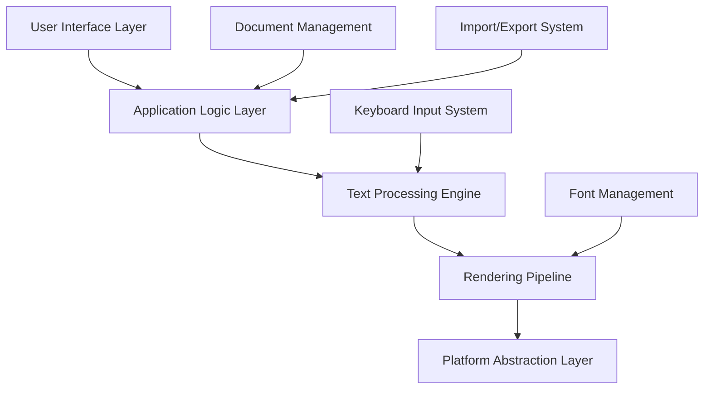

# La Compte Arabic Script Editor - Architecture Overview

## 🏗️ System Architecture

The La Compte Arabic Script Editor is built using a modular, layered architecture designed for performance, maintainability, and cross-platform compatibility.

## 📐 High-Level Architecture



## 🔧 Core Components

### 1. User Interface Layer
**Technology**: Qt 5/6 with custom RTL widgets
**Responsibility**: User interaction, visual presentation, event handling

```
ui/
├── main_window.py          # Primary application window
├── ribbon_toolbar.py       # MS Office-inspired toolbar
├── text_editor.py          # Custom RTL-aware text editor widget
├── formatting_panel.py     # Text formatting controls
├── document_view.py        # Document display and navigation
└── dialogs/                # Application dialogs
    ├── font_dialog.py
    ├── find_replace.py
    └── preferences.py
```

**Key Features**:
- RTL-optimized layout system
- Context-sensitive toolbars
- Keyboard shortcut management
- Theme and styling support

### 2. Application Logic Layer
**Technology**: Python with event-driven architecture
**Responsibility**: Business logic, state management, coordination

```
core/
├── application.py          # Main application controller
├── document_manager.py     # Document lifecycle management
├── command_system.py       # Undo/redo command pattern
├── settings_manager.py     # Application configuration
└── plugin_system.py       # Extensibility framework
```

**Design Patterns**:
- **Command Pattern**: For undo/redo functionality
- **Observer Pattern**: For UI updates and notifications
- **Strategy Pattern**: For different text processing algorithms
- **Factory Pattern**: For document and component creation

### 3. Text Processing Engine
**Technology**: Python with C extensions for performance
**Responsibility**: Unicode handling, RTL algorithms, text analysis

```
text/
├── unicode_processor.py    # Unicode text handling and validation
├── rtl_engine.py          # Right-to-left text flow algorithms
├── keyboard_mapper.py     # Keyboard input to Unicode conversion
├── text_analyzer.py       # Text statistics and analysis
├── cursor_manager.py      # Cursor positioning in RTL text
└── selection_manager.py   # Text selection handling
```

**Core Algorithms**:
- **Bidirectional Text Algorithm** (Unicode UAX #9)
- **Line Breaking Algorithm** (Unicode UAX #14)
- **Text Segmentation** (Unicode UAX #29)
- **Arabic Shaping** (Unicode UAX #9)

### 4. Rendering Pipeline
**Technology**: HarfBuzz + Qt + OpenType
**Responsibility**: Text shaping, font rendering, visual output

```
rendering/
├── text_renderer.py       # Main text rendering coordinator
├── harfbuzz_shaper.py     # HarfBuzz text shaping integration
├── font_manager.py        # Font loading and management
├── glyph_cache.py         # Rendered glyph caching system
└── opentype_handler.py    # OpenType feature management
```

**Rendering Pipeline Flow**:
```
Unicode Text → Text Analysis → Font Selection → Text Shaping → Glyph Positioning → Rendering
```

### 5. Document Management System
**Technology**: JSON-based format with binary optimization
**Responsibility**: Document storage, serialization, version control

```
documents/
├── document_model.py       # Core document data structure
├── json_serializer.py     # JSON-based document format
├── import_export.py       # Format conversion utilities
├── template_system.py     # Document templates
└── version_control.py     # Document history tracking
```

**Document Format Structure**:
```json
{
  "metadata": {
    "version": "1.0",
    "created": "2025-05-27T10:00:00Z",
    "language": "ur",
    "direction": "rtl"
  },
  "content": {
    "text": "Unicode text content",
    "formatting": [...],
    "structure": [...]
  },
  "settings": {
    "fonts": [...],
    "layout": {...}
  }
}
```

## 🔄 Data Flow Architecture

### Text Input Processing
```
Keyboard Input → Key Mapping → Unicode Conversion → Text Buffer → UI Update
```

### Text Rendering Process
```
Unicode Text → BiDi Analysis → Font Selection → Text Shaping → Layout → Rendering
```

### Document Operations
```
User Action → Command Creation → Text Processing → Document Update → UI Refresh
```

## 🎯 Performance Architecture

### Optimization Strategies

#### 1. **Lazy Loading**
- Fonts loaded on-demand
- Document sections loaded as needed
- UI components initialized when required

#### 2. **Caching Systems**
- **Glyph Cache**: Rendered text segments
- **Font Cache**: Loaded font objects
- **Layout Cache**: Calculated text layouts
- **Document Cache**: Recently accessed documents

#### 3. **Asynchronous Processing**
- Background font loading
- Non-blocking document operations
- Threaded text analysis
- Async export operations

#### 4. **Memory Management**
```python
class TextRenderer:
    def __init__(self):
        self.glyph_cache = LRUCache(maxsize=1000)
        self.layout_cache = LRUCache(maxsize=500)
        self.font_cache = WeakValueDictionary()
    
    def render_text(self, text: str) -> RenderedText:
        # Use cached results when possible
        cache_key = self.generate_cache_key(text, font, size)
        if cache_key in self.glyph_cache:
            return self.glyph_cache[cache_key]
        # ... rendering logic
```

## 🌐 Cross-Platform Architecture

### Platform Abstraction Layer
```
platform/
├── base_platform.py       # Abstract platform interface
├── linux_platform.py      # Linux-specific implementations
├── windows_platform.py    # Windows-specific implementations
├── macos_platform.py      # macOS-specific implementations
└── font_paths.py          # Platform-specific font locations
```

### Platform-Specific Considerations

#### **Linux**
- GTK theme integration
- Fontconfig for font discovery
- HiDPI scaling support
- Wayland compatibility

#### **Windows**
- Windows 7+ compatibility
- DirectWrite integration option
- High-contrast theme support
- Touch input handling

#### **macOS**
- Core Text integration option
- Retina display optimization
- macOS-specific keyboard shortcuts
- Accessibility support

## 🔌 Plugin Architecture

### Extensibility Framework
```
plugins/
├── plugin_interface.py    # Plugin base classes
├── plugin_manager.py      # Plugin loading and management
├── plugin_registry.py     # Plugin discovery and registration
└── builtin_plugins/       # Built-in plugin implementations
    ├── spell_checker.py
    ├── export_pdf.py
    └── import_docx.py
```

### Plugin Types
1. **Text Processors**: Custom text analysis and manipulation
2. **Import/Export**: Additional file format support
3. **UI Extensions**: Custom toolbar buttons and panels
4. **Language Support**: Additional language-specific features

## 🔒 Security Architecture

### Security Considerations
1. **Input Validation**: All text input sanitized and validated
2. **File System Access**: Restricted to designated directories
3. **Network Access**: Optional, with user consent
4. **Plugin Security**: Sandboxed plugin execution
5. **Document Integrity**: Checksum verification for documents

## 📊 Monitoring and Diagnostics

### Performance Monitoring
```python
class PerformanceMonitor:
    def __init__(self):
        self.metrics = {
            'startup_time': Timer(),
            'render_time': AverageTimer(),
            'memory_usage': MemoryTracker(),
            'font_loading_time': Timer()
        }
    
    def record_operation(self, operation: str, duration: float):
        # Record performance metrics
        pass
```

### Diagnostic Information
- Startup time measurement
- Memory usage tracking
- Font loading performance
- Text rendering speed
- Cross-platform compatibility metrics

## 🔄 Development Architecture

### Build System
```
scripts/
├── build.py               # Main build script
├── package.py             # Packaging for different platforms
├── test_runner.py         # Test execution and reporting
└── deploy.py              # Deployment automation
```

### Testing Architecture
```
tests/
├── unit/                  # Unit tests for individual components
├── integration/           # Integration tests for component interaction
├── ui/                    # UI automation tests
├── performance/           # Performance and benchmark tests
└── arabic_script/         # Arabic-specific text processing tests
```

## 🎯 Scalability Considerations

### Performance Scaling
- **Document Size**: Optimized for documents up to 1000+ pages
- **Font Collections**: Efficient handling of 100+ fonts
- **Concurrent Users**: Multi-document support within single instance
- **Memory Efficiency**: Target < 200MB for typical usage

### Feature Scaling
- **Plugin System**: Support for community-developed extensions
- **Language Support**: Framework for additional script systems
- **Export Formats**: Extensible format conversion system
- **Cloud Integration**: Architecture ready for cloud sync features

---

This architecture provides a solid foundation for building a professional-grade Arabic script editor while maintaining flexibility for future enhancements and community contributions.