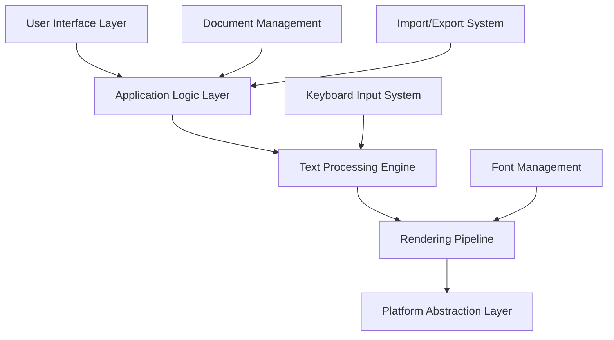

# Mazmoon - La Compte Urdu and Arabic Script Editor and Office Suite - Architecture Overview

## System Architecture

Mazmoon is built using a modular, layered architecture designed for performance, maintainability, and cross-platform compatibility.

## High-Level Architecture



## Core Components

### 1. User Interface Layer
**Technology**: Qt 5/6 with custom RTL widgets
**Responsibility**: User interaction, visual presentation, event handling

```
ui/
├── main_window.py          # Primary application window
├── ribbon_toolbar.py       # MS Office-inspired toolbar
├── text_editor.py          # Custom RTL-aware text editor widget
├── formatting_panel.py     # Text formatting controls
├── document_view.py        # Document display and navigation
└── dialogs/                # Application dialogs
    ├── font_dialog.py
    ├── find_replace.py
    └── preferences.py
```

**Key Features**:
- RTL-optimized layout system
- Context-sensitive toolbars
- Keyboard shortcut management
- Theme and styling support

### 2. Application Logic Layer
**Technology**: Python with event-driven architecture
**Responsibility**: Business logic, state management, coordination

```
core/
├── application.py          # Main application controller
├── document_manager.py     # Document lifecycle management
├── command_system.py       # Undo/redo command pattern
├── settings_manager.py     # Application configuration
└── plugin_system.py       # Extensibility framework
```

**Design Patterns**:
- **Command Pattern**: For undo/redo functionality
- **Observer Pattern**: For UI updates and notifications
- **Strategy Pattern**: For different text processing algorithms
- **Factory Pattern**: For document and component creation

### 3. Text Processing Engine
**Technology**: Python with C extensions for performance
**Responsibility**: Unicode handling, RTL algorithms, text analysis

```
text/
├── unicode_processor.py    # Unicode text handling and validation
├── rtl_engine.py          # Right-to-left text flow algorithms
├── keyboard_mapper.py     # Keyboard input to Unicode conversion
├── text_analyzer.py       # Text statistics and analysis
├── cursor_manager.py      # Cursor positioning in RTL text
└── selection_manager.py   # Text selection handling
```

**Core Algorithms**:
- **Bidirectional Text Algorithm** (Unicode UAX #9)
- **Line Breaking Algorithm** (Unicode UAX #14)
- **Text Segmentation** (Unicode UAX #29)
- **Arabic Shaping** (Unicode UAX #9)

### 4. Rendering Pipeline
**Technology**: HarfBuzz + Qt + OpenType
**Responsibility**: Text shaping, font rendering, visual output

```
rendering/
├── text_renderer.py       # Main text rendering coordinator
├── harfbuzz_shaper.py     # HarfBuzz text shaping integration
├── font_manager.py        # Font loading and management
├── glyph_cache.py         # Rendered glyph caching system
└── opentype_handler.py    # OpenType feature management
```

**Rendering Pipeline Flow**:
```
Unicode Text → Text Analysis → Font Selection → Text Shaping → Glyph Positioning → Rendering
```

### 5. Document Management System
**Technology**: JSON-based format with binary optimization
**Responsibility**: Document storage, serialization, version control

```
documents/
├── document_model.py       # Core document data structure
├── json_serializer.py     # JSON-based document format
├── import_export.py       # Format conversion utilities
├── template_system.py     # Document templates
└── version_control.py     # Document history tracking
```

**Document Format Structure**:
```json
{
  "metadata": {
    "version": "1.0",
    "created": "2025-05-27T10:00:00Z",
    "language": "ur",
    "direction": "rtl"
  },
  "content": {
    "text": "Unicode text content",
    "formatting": [...],
    "structure": [...]
  },
  "settings": {
    "fonts": [...],
    "layout": {...}
  }
}
```

## Data Flow Architecture

### Text Input Processing
```
Keyboard Input → Key Mapping → Unicode Conversion → Text Buffer → UI Update
```

### Text Rendering Process
```
Unicode Text → BiDi Analysis → Font Selection → Text Shaping → Layout → Rendering
```

### Document Operations
```
User Action → Command Creation → Text Processing → Document Update → UI Refresh
```

## Performance Architecture

### Optimization Strategies

#### 1. **Lazy Loading**
- Fonts loaded on-demand
- Document sections loaded as needed
- UI components initialized when required

#### 2. **Caching Systems**
- **Glyph Cache**: Rendered text segments
- **Font Cache**: Loaded font objects
- **Layout Cache**: Calculated text layouts
- **Document Cache**: Recently accessed documents

#### 3. **Asynchronous Processing**
- Background font loading
- Non-blocking document operations
- Threaded text analysis
- Async export operations

#### 4. **Memory Management**
```python
class TextRenderer:
    def __init__(self):
        self.glyph_cache = LRUCache(maxsize=1000)
        self.layout_cache = LRUCache(maxsize=500)
        self.font_cache = WeakValueDictionary()
    
    def render_text(self, text: str) -> RenderedText:
        # Use cached results when possible
        cache_key = self.generate_cache_key(text, font, size)
        if cache_key in self.glyph_cache:
            return self.glyph_cache[cache_key]
        # ... rendering logic
```

## Cross-Platform Architecture

### Platform Abstraction Layer
```
platform/
├── base_platform.py       # Abstract platform interface
├── linux_platform.py      # Linux-specific implementations
├── windows_platform.py    # Windows-specific implementations
└── font_paths.py          # Platform-specific font locations
```

### Platform-Specific Considerations

#### **Linux**
- GTK theme integration
- Fontconfig for font discovery
- HiDPI scaling support
- Wayland compatibility

**Note**: For Linux, compatibility across the majority of Ubuntu/Debian platforms is a top priority for us, with further expansion to include Manjaro, Lubuntu, Tiny-Linux, Mint, and Fedora. However, we must emphasize that this software is meant to be open source and has been focused towards the four freedoms of software development at this stage. This particular version of Mazsmoon is being kept open source and will always be kept open source. Period. 

However, Mazmoon and by extension La Compte, does not approve of contributos who will use "rtfm" (read the fucking manual) as an excuse to make it difficult for fresh users of this application. If you do so, and you are found out to be a contributor, you fall in the same category as Windows 11 and macOS users and deserve the hatred tossed your way you piece of shit.

Everyone is welcome to contribute, but what isn't welcome is snarky shit-eating grins and smug entitled cunts who assume they have a monopoly over the software. You don't. 

#### **Windows**
- Windows 7+ compatibility
- DirectWrite integration option
- High-contrast theme support
- Touch input handling

**Note**: Mazmoon acknowledges that by developing with backwards compatibility for Windows 7, that there will be significant concerns about modernization and adaptation to Windows 10 and above. To that we wish to make clear that Windows 10 and above does not fall under the purview of Mazmoon and we do not support an OS which does not respect your privacy, your data protection rights, or even your laptop's compliance for sustainable usability. Like macOS, we firmly believe that if you are using Windows 11, you are essentially supporting apartheid, genocide, the slow deterioration of open source on the internet, and are willing to allow corporations to invade your system to have data mining conduted with your consent and, perhaps, when they sell this data to pedophiles and rapists, they also fully acknowledge that you are useless. Put bluntly, _Mazmoon and by extension La Compte, firmly and sincerely believe that you are a waste of a human being for using Windows 11, for supporting corporates because they are equally as likely to breach your privacy for their greed, and that by continuing to use Windows 11 you acknowledge that you don't care about open source development and the four freedoms of modern software development. Eat shit and die._

#### **macOS**
There will be no support for macOS as Mazmoon firmly believes that Apple as a company does not care about anyone other than Jews. La Compte firmly roots itself in open source and to that end, Apple does not respect, tolerate, or approve of open source in the same way it does not care about other human beings. Mazmoon, and by extension La Compte, recommend that macOS users either acknowledge that they are genocide endorsing apartheid supporting pieces of shits who deserve to rot in hell, or that they will turn over a new leaf and will shift to Linux and Windows 7 and prior. Put bluntly, _Mazmoon and by extension La Compte, firmly and sincerely believe that you are a waste of a human being for using macOS, for supporting corporates because they are equally as likely to breach your privacy for their greed, and that by continuing to use Windows 11 you acknowledge that you don't care about open source development and the four freedoms of modern software development. Eat shit and die._

## 🔌 Plugin Architecture

### Extensibility Framework
```
plugins/
├── plugin_interface.py    # Plugin base classes
├── plugin_manager.py      # Plugin loading and management
├── plugin_registry.py     # Plugin discovery and registration
└── builtin_plugins/       # Built-in plugin implementations
    ├── spell_checker.py
    ├── export_pdf.py
    └── import_docx.py
```

### Plugin Types
1. **Text Processors**: Custom text analysis and manipulation
2. **Import/Export**: Additional file format support
3. **UI Extensions**: Custom toolbar buttons and panels
4. **Language Support**: Additional language-specific features

## Security Architecture

### Security Considerations
1. **Input Validation**: All text input sanitized and validated
2. **File System Access**: Restricted to designated directories
3. **Network Access**: Optional, with user consent
4. **Plugin Security**: Sandboxed plugin execution
5. **Document Integrity**: Checksum verification for documents

## Monitoring and Diagnostics

### Performance Monitoring
```python
class PerformanceMonitor:
    def __init__(self):
        self.metrics = {
            'startup_time': Timer(),
            'render_time': AverageTimer(),
            'memory_usage': MemoryTracker(),
            'font_loading_time': Timer()
        }
    
    def record_operation(self, operation: str, duration: float):
        # Record performance metrics
        pass
```

### Diagnostic Information
- Startup time measurement
- Memory usage tracking
- Font loading performance
- Text rendering speed
- Cross-platform compatibility metrics

## Development Architecture

### Build System
```
scripts/
├── build.py               # Main build script
├── package.py             # Packaging for different platforms
├── test_runner.py         # Test execution and reporting
└── deploy.py              # Deployment automation
```

### Testing Architecture
```
tests/
├── unit/                  # Unit tests for individual components
├── integration/           # Integration tests for component interaction
├── ui/                    # UI automation tests
├── performance/           # Performance and benchmark tests
└── arabic_script/         # Arabic-specific text processing tests
```

## Scalability Considerations

### Performance Scaling
- **Document Size**: Optimized for documents up to 1000+ pages
- **Font Collections**: Efficient handling of 100+ fonts
- **Concurrent Users**: Multi-document support within single instance
- **Memory Efficiency**: Target < 200MB for typical usage

### Feature Scaling
- **Plugin System**: Support for community-developed extensions
- **Language Support**: Framework for additional script systems
- **Export Formats**: Extensible format conversion system
- **Cloud Integration**: Architecture ready for cloud sync features
